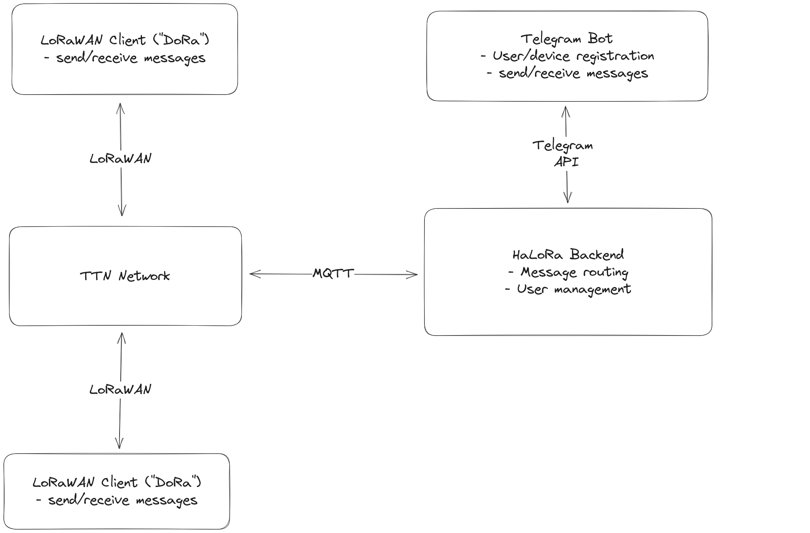
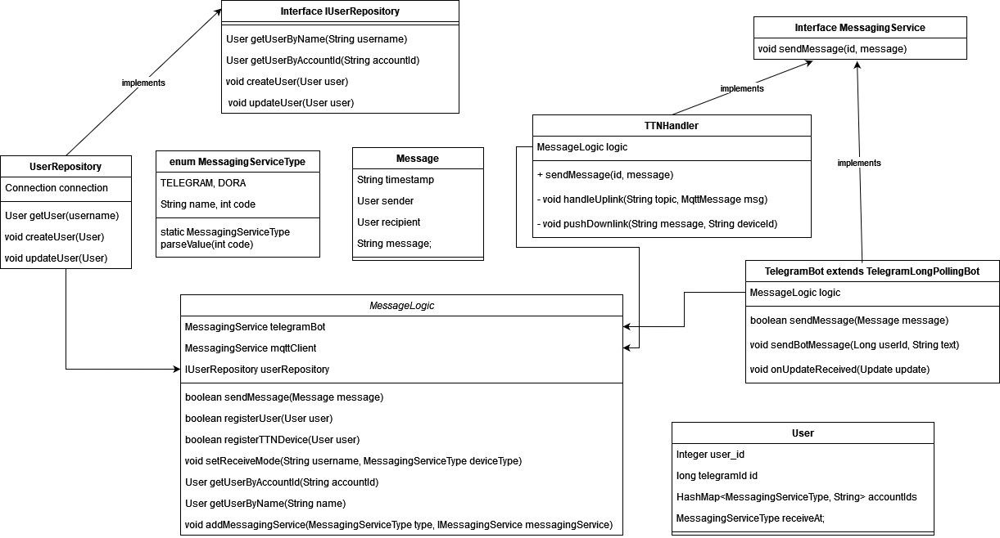

# HaLoRa Backend

This repository contains the Backend part of our project "HaLoRa", written during the course Innovation Lab 2 at UAS Technikum Wien.

It serves as a middleware between The Things Network, with which our Microcontroller devices talk to, and our Telegram Bot, which is used for user management and also for sending/receiving messages.
The repository for the Microcontroller-Software can be found [here](https://github.com/LoRaWahnsinn/HaLoRa_MC_Software).

This illustration provides an overview of all components of the project:


Additionally, this class diagram depicts the detailed structure of the backend component:


## Setup

In order to use the backend, you have to compile it yourself. You need to have maven present.

1. clone the repository, cd into the directory
2. add your configuration values to `src/main/resources/halora.properties` using the provided template

```properties
# Key/Password for the mqtt broker
MQTT_API_KEY=

# e.g. halora@ttn
MQTT_USER=

# e.g. tcp://mqtt.example.org:1883
MQTT_URI=

BOT_USERNAME=
BOT_TOKEN=

# Telegram Ids comma seperated
BOT_ALLOWED_USERS=
```
3. run `mvn install`
4. run `mvn clean compile assembly:single` to create a jar with bundled dependencies
5. execute `java -jar target/halora-backend-1.0-SNAPSHOT-jar-with-dependencies.jar`
6. now the backend should be up and running.

# Built with
- Java
- Maven
- SQLite
- Eclipse Paho MQTT Client
- Telegrambots


